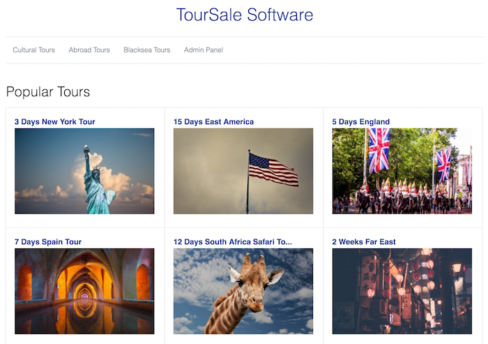
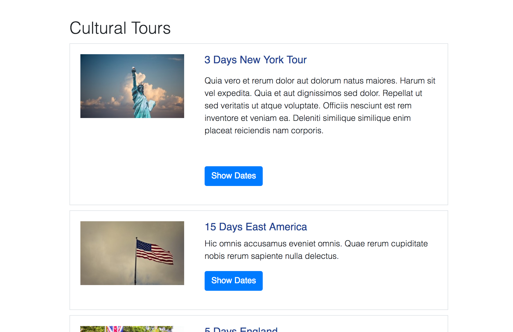
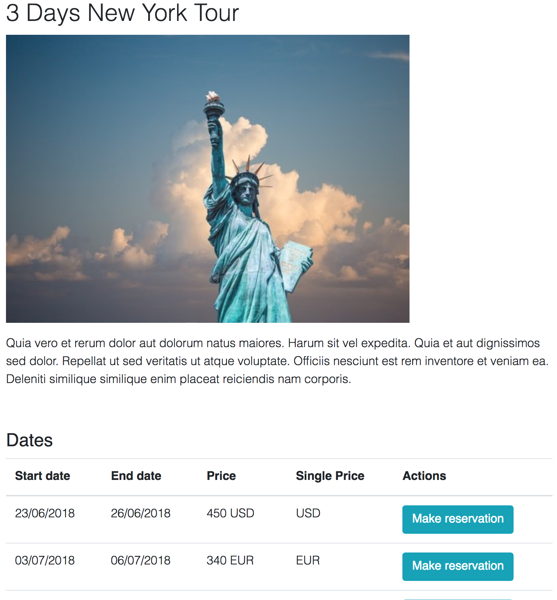
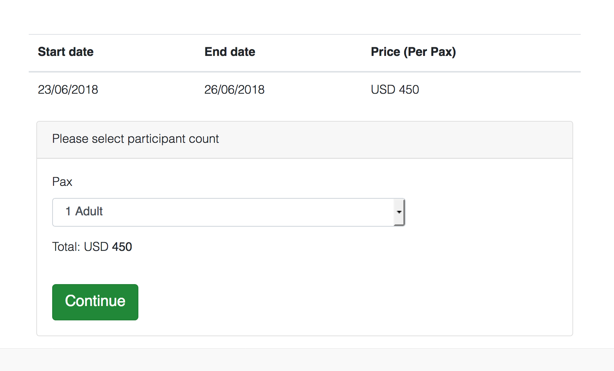
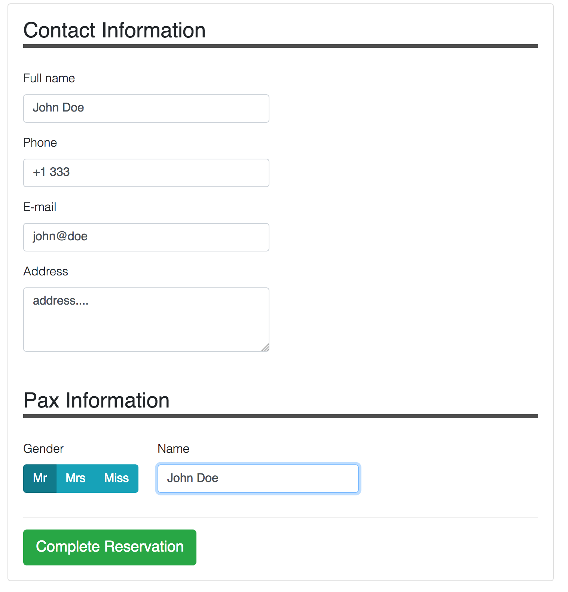
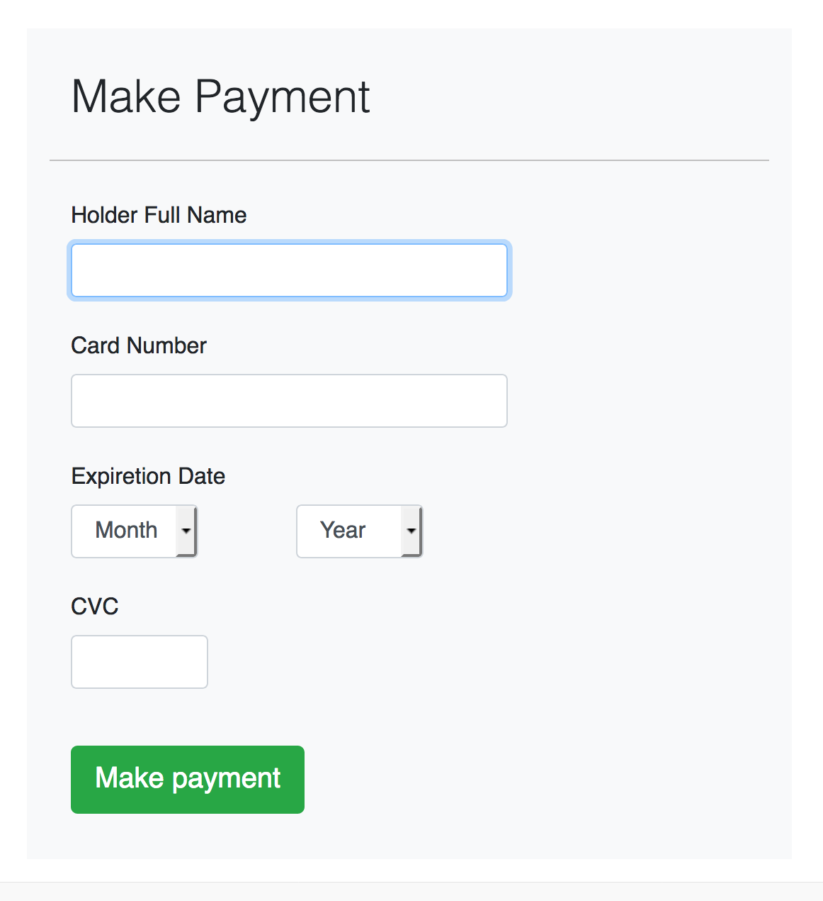
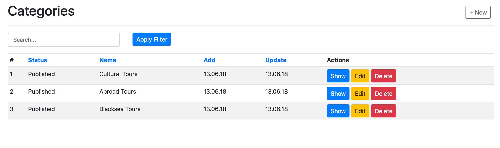
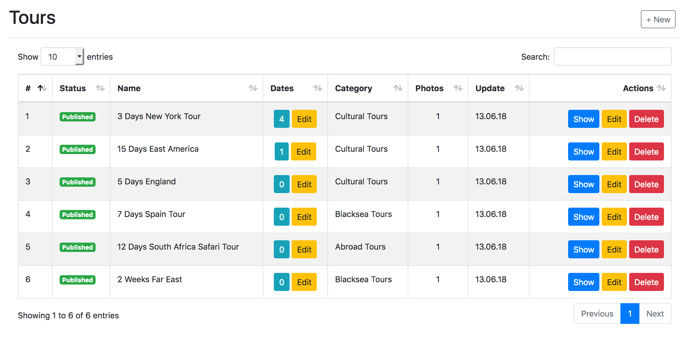
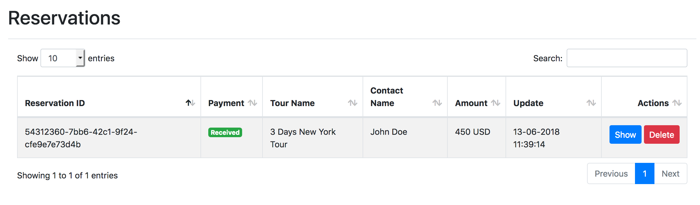

# TourSale | Laravel Tour Booking Software

TourSale is a tour booking system which built in Laravel and VueJs.

## How to install

```
git clone https://github.com/ylnn/laravel-tour-sale
```

Copy **.env.example** file to **.env**

Then update database settings in **.env** file.
```
composer install
php artisan migrate 
php artisan db:seed (if you want dummy data)
```

## Admin User:
```
email: admin@demo.com
password: demo
```

# Screenshots (front)








# Screenshots (admin)



